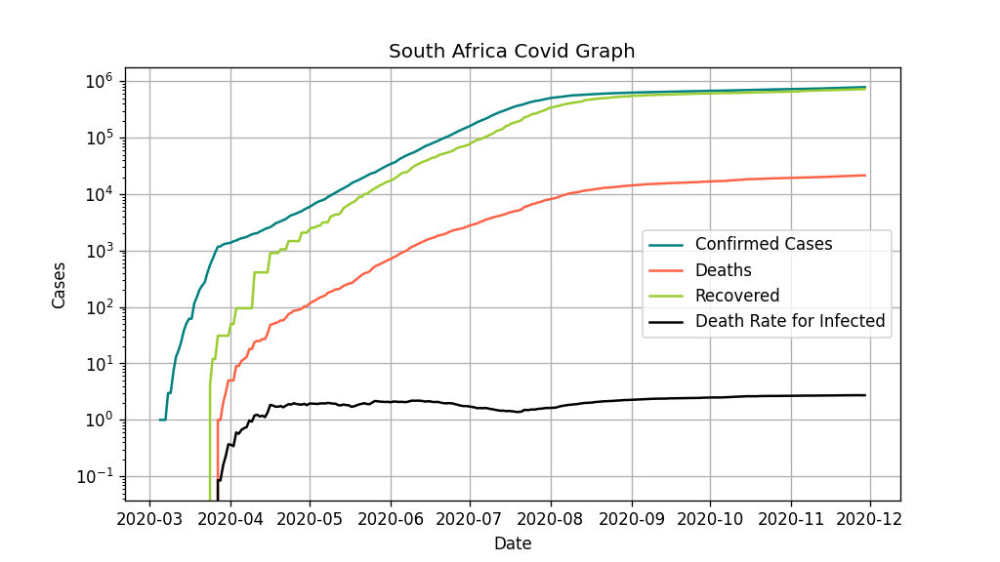

# covidStats

## Overview
Simple python program that makes use of the covid19api to print statistics about South Africa's Covid19 spread and plot relevant graphs.
The data.txt file is populated by data from the covid19api and is updated when the program is run a day after the data file was last updated.

## Example of the graph

Note: The graph is usually saved as a .pdf as this is vectorised instead of rasterized. A .png was used here for display purposes.
